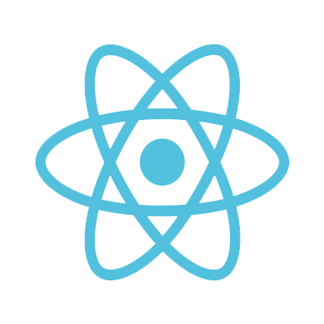
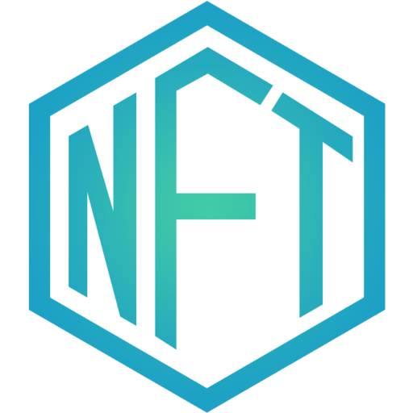

<h2>About Me </h2>

Passionate Full Stack & Blockchain Developer offering 6+ years of relevant experience in Blockchain, MLand Robotic.

I have experience developing DeFi, DEX, DApp, Trading Bot, Token, autonomous systems and artificial intelligence. I am fluent in Solidity, Web3.js, Python andJavaScript, andhave workedon a variety of projects as a consultant,helping clients achieve their goals.

I am also keen on several JavaScript and Python web frameworks like Vue, React, Django and Flask.

I am a life-long learner and is looking forward to working on exciting and challenging projects.

I am continuously trying to improve, learn more andgain new experiences.

Sincerely

## My Skills

### Languages/Frameworks I'm good at:
<code></code>
<code></code>

<code></code>
<code></code>
<code></code>

<code></code>
<code></code>

<code></code>
<code></code>
<code></code>

### Languages/Frameworks I'm learning now:
<code></code>

### Blockchain Technology:
<code></code>
<code></code>
<code></code>

### Environments I work with:

<code></code>
<code></code>
